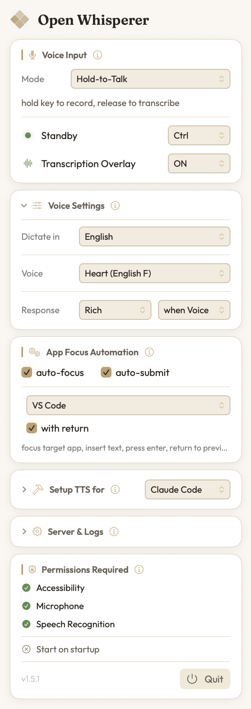

<p align="center">
  
</p>

# Open Whisperer

Full interactive Voice mode for [Claude Code](https://claude.ai/claude-code) and [Codex CLI](https://github.com/openai/codex) on Apple Silicon. Talk to your AI, hear it talk back — all running locally on your Mac. Three voice input modes, Auto-Focus & easy setup. Open Source.

<p align="center">
  
</p>

Build from source or DMG, do not pay the 99/year so you would have to allow it to run.

The command to bypass Gatekeeper for the DMG:
xattr -cr /Applications/OpenWhisperer.app

If you want to do it on the DMG itself before opening:
xattr -d com.apple.quarantine ~/Downloads/OpenWhisperer-1.5.1.dmg


## What It Does

You use Claude Code or Codex CLI normally. After a turn you dictated by voice, the AI's reply is automatically spoken aloud through your Mac's speakers using a local TTS model (you can also set replies to speak on typed turns, or always — see Response mode). Three voice input modes: **Press-to-Talk** (press hotkey to start/stop), **Hold-to-Talk** (hold hotkey to record, release to transcribe), or **Hands-Free** (say "initiate" to start recording, 3s silence auto-transcribes, say "hold on" to interrupt TTS).

Everything runs on your Mac — no cloud APIs, no data leaves your machine.

## What's New in 1.5.x

### 1.5.1

- **Auto-focus any installed app** — the **Automation** dropdown now offers a searchable list of *every* app installed on your Mac (Word, WhatsApp, Slack, …), alongside the curated dev/terminal favorites and a Custom entry. Search it by name and pin dictation to whichever app you like.
- **Snappier menu** — fixed a 3–4 second freeze when opening the menubar popover. A synchronous "launch at login" status check (an XPC call to `launchservicesd`) was blocking the main thread on every open; it now runs off-main.
- **Response mode** — a new **Response** control in Voice Settings (beside Style) chooses *when* replies are spoken: **when Voice** (dictated turns only — the default, unchanged), **when Text** (typed turns only), or **Always**. Per-project override via `OW_TTS_RESPONSE`.
- **Automation polish** — "with return" is grouped under auto-focus, and the behavior hint now reflects your exact auto-focus / with-return / auto-submit combination.
- **In-app help** — a hover **ⓘ** on every section explains what it does, and the Hook setup instructions are corrected to document both hooks (Stop + UserPromptSubmit).
- **Menu tidy** — the auto-focus card is now **App Focus Automation**, the platform/setup card is **Setup TTS for** (with Volume tucked inside), and all section titles share one consistent weight.

### 1.5.0

- **Fully native, no Python** — speech-to-text (WhisperKit) and text-to-speech (FluidAudio Kokoro) run in-process on the Apple Neural Engine. The Python server, virtualenv, and `setup.sh` are gone, so install is just "drag to Applications," cold start is faster, and a whole class of dependency-drift failures disappears.
- **In-app streaming playback + instant barge-in** — replies start speaking after the first sentence and play gaplessly; saying "hold on" (or starting a new turn) stops audio *and* cancels in-flight synthesis in-process, freeing the Neural Engine immediately.
- **Tagless voice mode** — no more `[VOICE:]` tag in `CLAUDE.md`. The app fingerprints each dictation and a `UserPromptSubmit` hook routes the spoken reply to the session you actually dictated into; only dictated turns are spoken.
- **Warm redesign** — the menubar and transcription overlay now match [openwhisperer.com](https://openwhisperer.com): a warm cream/gold palette with a Fraunces serif wordmark, in full light **and** dark mode.
- **WhisperKit 1.0** — the speech-to-text engine is updated to the 1.0 stable release.
- **Reliability hardening** — generation-guarded TTS cancellation, a request body-size cap and surfaced bind-failure on the loopback TTS server, the "Speaking…" lock now clears if the output device drops mid-reply, and a uniform voice-turn freshness window so dictating then pausing before submit still speaks.
- **Garbled-speech fix on Apple Silicon** — on some chips (notably M3 / macOS 15) a strided CoreML array was mis-read, producing fluent-but-*wrong*, "foreign-sounding" speech regardless of the text; updated to the upstream fix so synthesis is correct across Apple Silicon generations.
- **Delete downloaded models** — a maintenance button in **Server & Logs** clears the STT/TTS model caches after a confirmation that shows how much space it frees; the models re-download automatically on next use.

## Install

[**Download OpenWhisperer-1.5.1.dmg**](https://github.com/PerIPan/OpenWhisperer/releases/download/v1.5.1/OpenWhisperer-1.5.1.dmg) — drag to Applications and launch.

On first launch, the app:
- Downloads the Whisper (speech-to-text) and Kokoro (text-to-speech) CoreML models
- Loads both models on the Apple Neural Engine
- Starts the in-app TTS server automatically (loopback only, port 8000)

The menubar icon gives you:
- Start/Stop/Restart server with configurable port
- **Push-to-Talk** — configurable hotkey (Ctrl, fn, Option, Cmd) to record
- **Language selector** — set STT language to avoid hallucinations (auto-detect plus 17 languages)
- **Voice picker** — choose from six Kokoro voices across English (Heart, Bella, Michael), French (Siwis), and Italian (Sara, Nicola) (no server restart needed)
- **Style** — how verbose the spoken summary is: Terse, Normal (default), Rich, or Full (speaks the entire reply)
- **Response** — when replies are spoken: when Voice (dictated turns only, the default), when Text (typed turns only), or Always
- **Volume** — Low, Medium (default), or High output volume (in the **Setup TTS for** card)
- **Start on startup** — optional login item to launch automatically when you log in
- **App Focus Automation** — Auto-Focus and Auto-Submit (requires Accessibility permission)
- **Platform selector** — switch between Claude Code and Codex CLI (auto-configures hooks)
- **Auto-Apply** — one-click setup for the hooks (adapts to selected platform)
- **Accessibility prompt** — asks for permission on first launch with live granted/not-granted status
- **Diagnostic checklist** — shows hook and TTS status at a glance
- **Transcription overlay** — floating window showing live waveform and recent transcriptions
- **Events log** — diagnostic log for troubleshooting paste and transcription issues
- TTS server log (the in-app native TTS server)

After setup, use the menubar buttons for configuration instructions.

## Voice Input Modes

Three modes for speech-to-text, all using your local Whisper model. Transcribed text is typed directly into whatever app you have focused.

### Hold-to-Talk (default)

1. Hold **Ctrl** — recording starts immediately
2. Speak your message
3. Release **Ctrl** — audio is transcribed and inserted

### Press-to-Talk

1. Press **Ctrl** — recording starts (red indicator)
2. Speak your message
3. Press **Ctrl** again — audio is sent to Whisper for transcription
4. Text is inserted via Accessibility (native apps) or CGEvent Unicode typing (all others) — clipboard is never touched

### Hands-Free

No button press needed. Uses on-device keyword detection (Apple Speech framework).

1. say **"initiate"** — recording starts (cyan → red indicator)
2. speak your message
3. **3 seconds of silence** — audio is auto-transcribed and inserted
4. returns to listening for "initiate" again
5. say **"hold on"** during TTS playback — interrupts audio and starts recording

> **Tip:** "Hold on" barge-in works best with headphones — without them the mic may pick up the TTS audio instead of your voice.

<p align="center">
  
</p>

### Requirements

- **Microphone permission** — macOS will prompt on first use
- **Accessibility permission** — required for typing text into other apps. Grant in System Settings → Privacy & Security → Accessibility

> **Note:** After rebuilding from source, you must remove and re-add the app in Accessibility settings (macOS caches the code signature).

### App Focus Automation

Both features are in the **App Focus Automation** section of the menubar and require **Accessibility permission** (macOS will prompt you on first use).

#### Auto-Focus

Enable **Auto-Focus** to automatically bring a specific app to the front when you finish speaking. The app picker is searchable: type a name to filter across **every app installed on your Mac** (Word, WhatsApp, Slack, …), plus a curated **Favorites** section of dev/terminal apps (VS Code, Cursor, Windsurf, Zed, Xcode, Sublime Text, Nova, Fleet, Claude, Terminal, iTerm2, Warp, Alacritty, Ghostty), plus a **Custom…** entry to type any app name. Uses native `NSRunningApplication.activate()` — no System Events permission needed.

#### Auto-Submit

Enable **Auto-Submit** to automatically submit after every transcription — no trigger word needed. The transcribed text is typed and Enter is pressed.

**Barge-in:** Any currently playing TTS audio is automatically interrupted when you start recording (press Ctrl) or when Auto-Submit triggers, so you can speak without waiting for the AI to finish talking.

### Fallback: macOS Dictation

If you prefer not to grant Accessibility permission, press **fn fn** to use built-in macOS dictation. Less accurate for technical terms, but works instantly with zero setup.

## How Spoken Replies Work

There's no special tag to add — voice mode works automatically. The app and its hooks coordinate so that only **voice-dictated** turns are spoken; turns you type stay silent:

1. When you dictate, the app records a fingerprint of the text it inserted.
2. The **UserPromptSubmit** hook recognizes that turn as a voice turn and quietly nudges the model to open its reply with a short summary that stands alone.
3. The **Stop** hook takes the first paragraph of the reply, strips markdown (capped at ~600 characters), and speaks it through the local Kokoro TTS model.

- **Screen**: you see the full detailed response
- **Speakers**: you hear the spoken opening summary

This "dictated turns only" behavior is the default. The **Response** control in Voice Settings changes *when* replies are spoken: **when Voice** (dictated turns only — the default), **when Text** (typed turns only), or **Always** (every turn). Per-project override via `OW_TTS_RESPONSE`.

### Voice Style Levels

Choose how verbose that opening summary should be (set in the menubar under **Style**, the left dropdown of the Voice Settings **Response** row):

| Level | Spoken summary |
|-------|----------------|
| **Terse** | One short sentence — just the key outcome |
| **Normal** | One plain sentence (default) |
| **Rich** | A sentence or two of summary |
| **Full** | The entire reply, read as natural spoken prose (code/paths/tables described, not read literally) |

## Configuration

Most settings are configured from the menubar (voice, volume, language, hotkey, style, response mode) and stored under `~/Library/Application Support/OpenWhisperer`. The hooks and `speak.sh` also honor a few environment variables:

| Variable | Default | Used by | Description |
|----------|---------|---------|-------------|
| `TTS_VOICE` | `af_heart` | hooks, `speak.sh` | Kokoro voice name (the menubar voice picker overrides this) |
| `TTS_PLAY_URL` | `http://localhost:8000/v1/audio/play` | hooks | In-app streaming-playback endpoint (loopback only) |
| `TTS_URL` | `http://localhost:8000/v1/audio/speech` | `speak.sh` | Blocking synthesize-to-WAV endpoint |
| `TTS_VOLUME` | `1` | `speak.sh` | Playback volume (the in-app player uses the menubar volume setting instead) |
| `OW_TTS_STYLE` | menubar **Style** | hooks | Per-project spoken-summary style (`terse`/`normal`/`rich`/`full`); overrides the global `tts_style` |
| `OW_TTS_VOICE` | menubar voice | hooks | Per-project Kokoro voice; overrides the global `tts_voice` |
| `OW_TTS_RESPONSE` | menubar **Response** | hooks | Per-project response mode (`voice`/`text`/`always`); overrides the global `tts_response_mode` |

> **Tip:** Setting a specific language (e.g. English) instead of auto-detect prevents Whisper from hallucinating text in other languages during silence or background noise.

## Troubleshooting

**No audio after response:**
1. Check the TTS server is running: `curl http://localhost:8000/v1/models`
2. Test TTS directly: `echo "hello" | ./scripts/speak.sh`
3. Check the hook path in `settings.json` is correct and absolute
4. Remember only **dictated** turns are spoken — typed prompts stay silent by design

**Push-to-talk not typing text:**
1. Check Accessibility permission is granted in System Settings
2. If rebuilt from source, remove and re-add the app in Accessibility settings (macOS caches the code signature)
3. Check the Events Log in the menubar for diagnostic details

---

## Building from Source

> **Tip:** You can ask your AI assistant (Claude, ChatGPT, etc.) to run these steps for you. Just paste the section below into your AI chat.

### Prerequisites

- Mac with Apple Silicon (M1/M2/M3/M4), macOS 14 or later
- Xcode Command Line Tools (`xcode-select --install`) — provides `swift`
- [Claude Code](https://claude.ai/claude-code) or [Codex CLI](https://github.com/openai/codex)
- [jq](https://jqlang.github.io/jq/) — only needed to run the hooks straight from the source tree (the built `.app` bundles its own copy). Install with one of:
  ```bash
  # Option A: Direct download (no package manager needed)
  curl -L -o /usr/local/bin/jq https://github.com/jqlang/jq/releases/download/jq-1.7.1/jq-macos-arm64 && chmod +x /usr/local/bin/jq

  # Option B: Homebrew (if you have it)
  brew install jq
  ```

There is **no Python, virtualenv, or `pip`/`uv` step** — speech-to-text and text-to-speech are native Swift (WhisperKit + FluidAudio) and run in-process on the Apple Neural Engine.

### Step 1: Build the app

```bash
git clone https://github.com/PerIPan/OpenWhisperer.git
cd OpenWhisperer/app
chmod +x build-dmg.sh
./build-dmg.sh
```

This produces `OpenWhisperer.app` and `OpenWhisperer-1.5.1.dmg` in `app/.build/`. Launch the app — on first launch it downloads the Whisper and Kokoro models, then starts the in-app TTS server on `localhost:8000` automatically. (For a plain debug build during development, run `swift build` from `app/`.)

### Step 2: Wire up the hooks

The easiest path is the menubar's **Auto-Apply** button, which writes the right hooks for the selected platform (Claude Code or Codex CLI). To do it by hand for Claude Code, add this to `~/.claude/settings.json` (or a project's `.claude/settings.json`):

```json
{
  "hooks": {
    "Stop": [
      { "hooks": [ { "type": "command", "command": "/absolute/path/to/OpenWhisperer/hooks/tts-hook.sh", "timeout": 60 } ] }
    ],
    "UserPromptSubmit": [
      { "hooks": [ { "type": "command", "command": "/absolute/path/to/OpenWhisperer/hooks/voice-context.sh", "timeout": 60 } ] }
    ]
  }
}
```

Replace `/absolute/path/to/OpenWhisperer` with where you cloned the repo. The `UserPromptSubmit` hook detects voice turns; the `Stop` hook speaks the reply. That's all — no `CLAUDE.md` or `[VOICE:]` tag is required.

### Running the TTS server headlessly

For testing or CI you can run just the native TTS server, no GUI:

```bash
cd app
swift run OpenWhisperer --serve-tts   # serves http://localhost:8000 (set TTS_PORT to change)
```

## File Structure

```
OpenWhisperer/
├── CLAUDE.md                 # Guidance for AI assistants working on this repo
├── hooks/
│   ├── tts-hook.sh           # Claude Code Stop hook — speaks the reply's first paragraph
│   ├── voice-context.sh      # Claude Code UserPromptSubmit hook — voice-turn detection
│   ├── codex-tts-hook.sh     # Codex CLI notify hook
│   └── speakable-text.sh     # Shared spoken-text extractor
├── scripts/
│   └── speak.sh              # Standalone TTS utility (pipe text to hear it)
└── app/                      # macOS menubar app (Swift Package)
    ├── Package.swift
    ├── Sources/
    │   ├── OpenWhisperer/     # App + native STT (WhisperKit) + native TTS (FluidAudio)
    │   └── OpenWhispererKit/  # Pure, unit-tested logic
    ├── Tests/
    ├── Resources/
    └── build-dmg.sh          # Build the .app + .dmg
```

## Contributing

Contributions are welcome! Feel free to open issues or submit pull requests. Whether it's bug fixes, new features, documentation improvements, or voice model suggestions — all contributions are appreciated.

## Acknowledgments

The native rewrite at the heart of this app — replacing the out-of-process Python server with fully in-process Swift speech-to-text (WhisperKit) and text-to-speech (FluidAudio Kokoro), in-process streaming playback and barge-in, and the tagless voice-turn handshake — was contributed by [**Hakan Ensari**](https://github.com/hakanensari) ([fork](https://github.com/hakanensari/OpenWhisperer)). It removed the Python/venv stack entirely and made the app notarizable. Thank you!

## Credits

- [WhisperKit](https://github.com/argmaxinc/WhisperKit) — on-device speech-to-text (CoreML / Apple Neural Engine)
- [FluidAudio](https://github.com/FluidInference/FluidAudio) — on-device Kokoro text-to-speech (CoreML / Apple Neural Engine)
- [Kokoro](https://huggingface.co/prince-canuma/Kokoro-82M) — TTS model
- [jq](https://jqlang.github.io/jq/) — JSON processor (used by the hooks)
- [Claude Code](https://claude.ai/claude-code) — Anthropic's CLI
- [Codex CLI](https://github.com/openai/codex) — OpenAI's CLI agent

## License

MIT
